<div align="center">

# 🖼️ Image Processing with OpenCV

**A hands-on reference notebook for the essential Computer Vision operations.**  
Code + real outputs for every function — because GitHub doesn't render notebook images.

[](https://colab.research.google.com/drive/1gxUt5MxeQyqHKL-RyystYJgRZJXCCRiH?usp=sharing)


</div>

---

## 🌍 Why Do We Need Image Processing?

Before any computer vision model can understand an image, the image usually needs to be **cleaned, transformed, and prepared**. That's what image processing is — the step between raw pixel data and meaningful insight.

Here are real examples where these exact functions are used every day:

| Function | Real-World Application |
|----------|----------------------|
| **Grayscaling** | Medical X-ray analysis — color carries no diagnostic value, reducing channels speeds up processing |
| **Blurring** | Autonomous vehicles — noise removal before lane line detection |
| **Edge Detection** | Manufacturing quality control — detecting cracks or defects on a production line |
| **Thresholding** | Document scanning apps (like CamScanner) — separating text from background |
| **Morphological Ops** | Fingerprint recognition systems — thinning ridges to extract features |
| **Histogram Equalization** | Satellite & aerial imaging — enhancing low-contrast terrain features |
| **Color Spaces (HSV)** | Fruit sorting robots — detecting ripe vs unripe by hue regardless of lighting |
| **Contour Detection** | Cell counting in biology — identifying and measuring individual cells under a microscope |
| **Perspective Transform** | AR applications & document scanners — correcting a photographed page to look flat |
| **Gamma Correction** | Camera pipelines — adjusting brightness for display on different screens |
| **Resizing & Interpolation** | Deep learning pipelines — resizing all input images to a fixed size (e.g., 224×224) before feeding into a CNN |
| **HOG Features** | Pedestrian detection in traffic systems — still used in real-time embedded cameras |
| **Flipping** | Data augmentation — doubling a dataset cheaply before training a classifier |

> 💡 Whether you're building a face recognition app, a crop disease detector, or a medical imaging tool — image processing is always the foundation.

---

## 📦 Requirements

```bash
pip install opencv-python numpy matplotlib scikit-image
```

---

## 📋 Table of Contents

| # | Topic | Key Functions |
|---|-------|---------------|
| 1 | [Reading & Saving Images](#1-reading--saving-images) | `cv2.imread`, `cv2.imwrite`, `cv2.cvtColor` |
| 2 | [Grayscaling](#2-grayscaling) | `COLOR_BGR2GRAY` |
| 3 | [Image Blurring](#3-image-blurring) | `GaussianBlur`, `medianBlur`, `bilateralFilter` |
| 4 | [Resizing & Scaling](#4-resizing--scaling) | `cv2.resize` + interpolation flags |
| 5 | [Image Rotation](#5-image-rotation) | `getRotationMatrix2D`, `warpAffine` |
| 6 | [Edge Detection](#6-edge-detection) | `cv2.Canny`, Auto-Canny |
| 7 | [Morphological Operations](#7-morphological-operations) | `dilate`, `erode`, `morphologyEx` |
| 8 | [Flipping](#8-flipping) | `cv2.flip` |
| 9 | [Cropping](#9-cropping) | NumPy slicing |
| 10 | [Sharpening](#10-sharpening) | `cv2.filter2D` + kernel |
| 11 | [Thresholding](#11-thresholding) | `cv2.threshold` — 5 types |
| 12 | [Adaptive Thresholding & Otsu](#12-adaptive-thresholding--otsu) | `adaptiveThreshold`, `THRESH_OTSU` |
| 13 | [Histogram Equalization & CLAHE](#13-histogram-equalization--clahe) | `equalizeHist`, `createCLAHE` |
| 14 | [Color Space Conversions](#14-color-space-conversions) | HSV, LAB, YCrCb |
| 15 | [Image Blending & Arithmetic](#15-image-blending--arithmetic) | `addWeighted`, `cv2.add` |
| 16 | [Contour Detection](#16-contour-detection) | `findContours`, `drawContours` |
| 17 | [Perspective Transform](#17-perspective-transform) | `getPerspectiveTransform`, `warpPerspective` |
| 18 | [Intensity Transformations](#18-intensity-transformations) | Negative, Log, Gamma, Contrast Stretching |
| 19 | [HOG Feature Extraction](#19-hog-feature-extraction) | `skimage.feature.hog` |

---

## 1. Reading & Saving Images

```python
img = cv2.imread('image.jpg', 1)   # 1 = color (BGR),  0 = grayscale
plt.imshow(cv2.cvtColor(img, cv2.COLOR_BGR2RGB))
cv2.imwrite('output.jpg', img)
```

> ⚠️ **BGR vs RGB:** OpenCV reads images in **BGR** order — always convert with `cv2.COLOR_BGR2RGB` before displaying with Matplotlib.

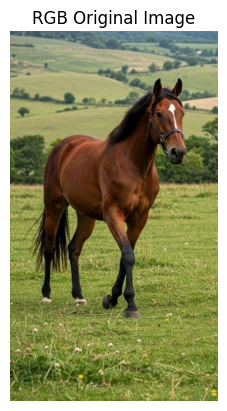

---

## 2. Grayscaling

Converts `(H×W×3)` → `(H×W)` — required by many OpenCV functions like Canny, morphology, and thresholding.

```python
gray = cv2.cvtColor(img, cv2.COLOR_BGR2GRAY)               # Method 1
gray = cv2.imread('image.jpg', 0)                          # Method 2
gray = np.dot(img[..., :3], [0.114, 0.587, 0.2989]).astype(np.uint8)  # Method 3
```

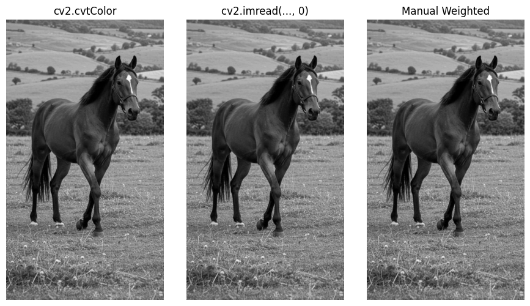

---

## 3. Image Blurring

| Method | Best For | Preserves Edges? |
|--------|----------|:---:|
| `GaussianBlur` | General noise, preprocessing | ❌ |
| `medianBlur` | Salt-and-pepper noise | ⚠️ |
| `bilateralFilter` | Noise with edge preservation | ✅ |

```python
gaussian  = cv2.GaussianBlur(img, (13, 13), 0)   # kernel must be odd!
median    = cv2.medianBlur(img, 13)
bilateral = cv2.bilateralFilter(img, 15, 75, 75)
```

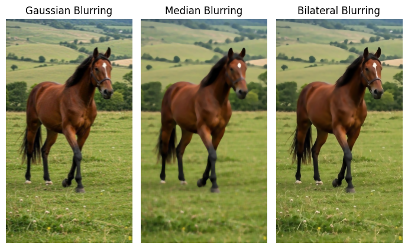

---

## 4. Resizing & Scaling

```python
zoomed  = cv2.resize(img, None, fx=2.0, fy=2.0, interpolation=cv2.INTER_CUBIC)
reduced = cv2.resize(img, None, fx=0.5, fy=0.5, interpolation=cv2.INTER_AREA)
```

| Flag | Best For |
|------|----------|
| `INTER_NEAREST` | Fastest, lowest quality |
| `INTER_LINEAR` | General use |
| `INTER_CUBIC` | **Enlarging** |
| `INTER_LANCZOS4` | Highest quality |
| `INTER_AREA` | **Downscaling** |

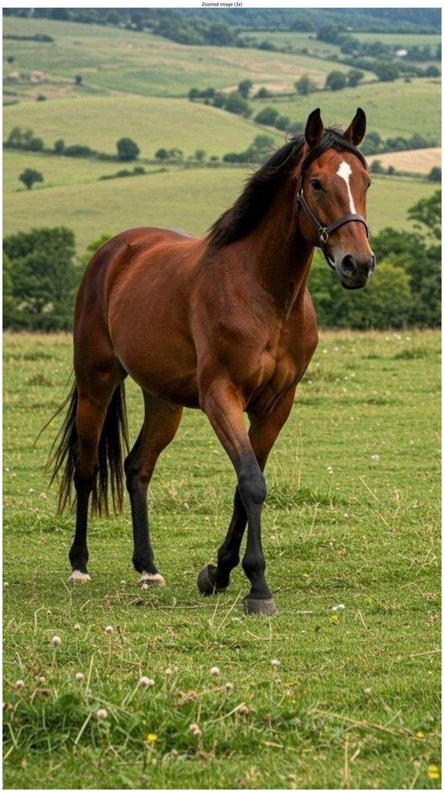

---

## 5. Image Rotation

```python
center  = (img.shape[1] // 2, img.shape[0] // 2)
M       = cv2.getRotationMatrix2D(center, angle=30, scale=1)
rotated = cv2.warpAffine(img, M, (img.shape[1], img.shape[0]))
```

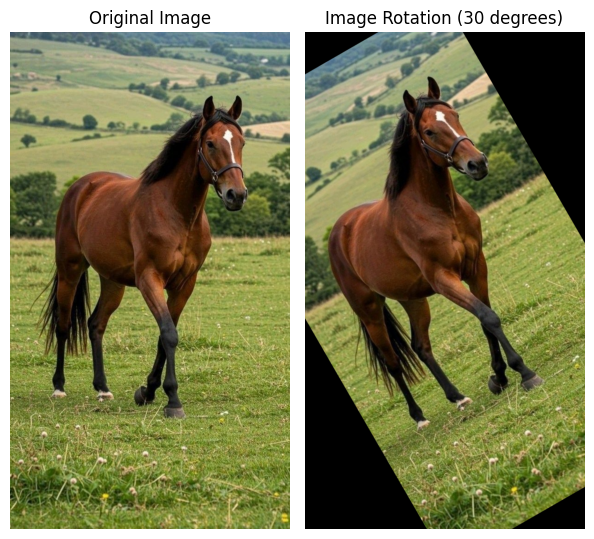

---

## 6. Edge Detection

Auto-Canny automatically computes optimal thresholds from the image's median intensity — no manual tuning.

```python
def auto_canny(image, sigma=0.33):
    v     = np.median(image)
    lower = int(max(0,   (1.0 - sigma) * v))
    upper = int(min(255, (1.0 + sigma) * v))
    return cv2.Canny(image, lower, upper)
```

> 💡 Always blur **before** Canny to suppress false edges from noise.

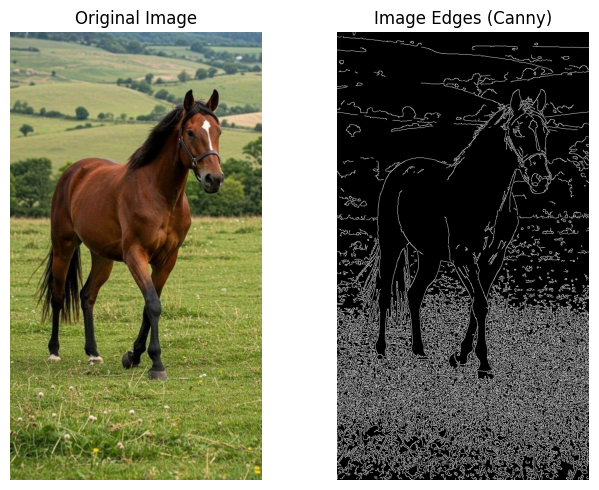

---

## 7. Morphological Operations

> ⚠️ Requires **grayscale or binary input** — not a 3-channel color image.

```python
kernel   = np.ones((5, 5), np.uint8)
dilated  = cv2.dilate(gray, kernel, iterations=1)
eroded   = cv2.erode(gray, kernel, iterations=1)
opening  = cv2.morphologyEx(gray, cv2.MORPH_OPEN,     kernel)  # removes noise
closing  = cv2.morphologyEx(gray, cv2.MORPH_CLOSE,    kernel)  # fills holes
gradient = cv2.morphologyEx(gray, cv2.MORPH_GRADIENT, kernel)  # object outline
```

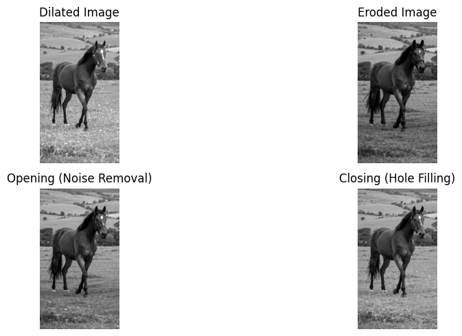

---

## 8. Flipping

```python
hflip = cv2.flip(img,  1)   # horizontal
vflip = cv2.flip(img,  0)   # vertical
both  = cv2.flip(img, -1)   # both axes
```

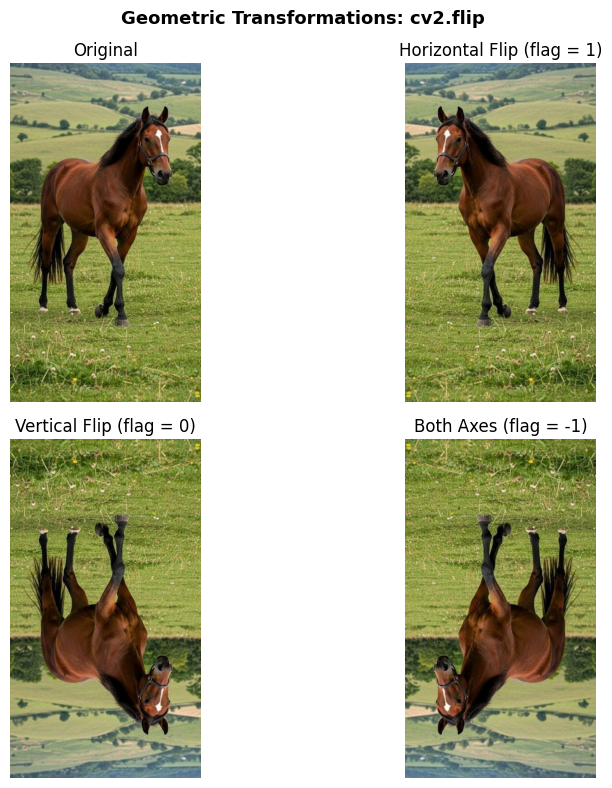

---

## 9. Cropping

No special function — pure **NumPy array slicing**. Indexed as `[row, col]` = `[y, x]`.

```python
cropped = img[start_row:end_row, start_col:end_col]
```

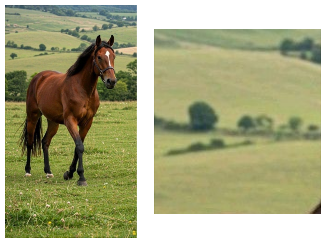

---

## 10. Sharpening

$$K = \begin{bmatrix} -1 & -1 & -1 \\ -1 & 9 & -1 \\ -1 & -1 & -1 \end{bmatrix}$$

```python
kernel    = np.array([[-1,-1,-1], [-1,9,-1], [-1,-1,-1]])
sharpened = cv2.filter2D(img, -1, kernel)
```

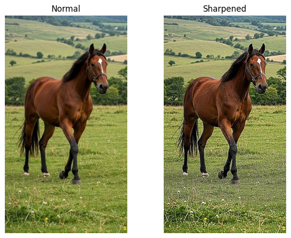

---

## 11. Thresholding

`cv2.threshold(src, thresh, maxval, type)`

| Type | Behavior |
|------|----------|
| `THRESH_BINARY` | `> thresh` → maxval, else → 0 |
| `THRESH_BINARY_INV` | `> thresh` → 0, else → maxval |
| `THRESH_TRUNC` | `> thresh` → thresh, else unchanged |
| `THRESH_TOZERO` | `> thresh` → unchanged, else → 0 |
| `THRESH_TOZERO_INV` | `> thresh` → 0, else unchanged |

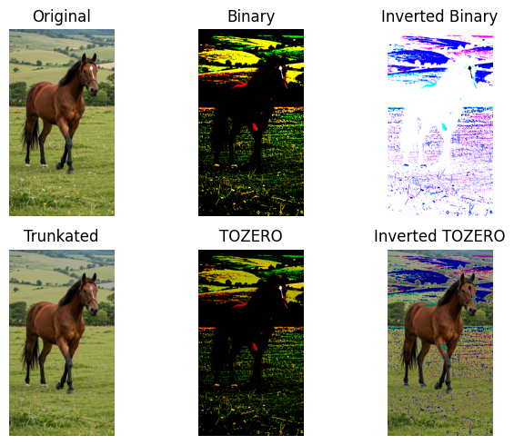

---

## 12. Adaptive Thresholding & Otsu

Global thresholding **fails under uneven lighting**. Adaptive computes a local threshold per region.

```python
# Otsu — finds optimal threshold automatically
_, otsu = cv2.threshold(gray, 0, 255, cv2.THRESH_BINARY + cv2.THRESH_OTSU)

# Adaptive — local threshold per block
adaptive = cv2.adaptiveThreshold(
    gray, 255, cv2.ADAPTIVE_THRESH_GAUSSIAN_C, cv2.THRESH_BINARY, 21, 5)
```

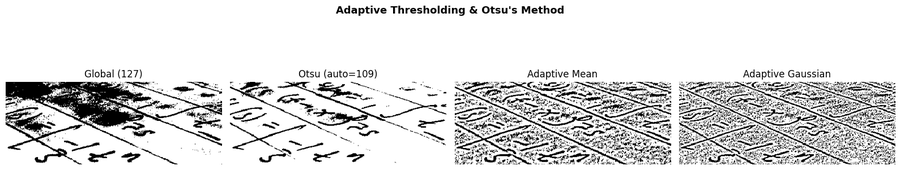

---

## 13. Histogram Equalization & CLAHE

**CLAHE** applies equalization locally in tiles — preferred for medical images and low-light photography.

```python
eq    = cv2.equalizeHist(gray)

clahe = cv2.createCLAHE(clipLimit=2.0, tileGridSize=(8, 8))
eq_cl = clahe.apply(gray)
```

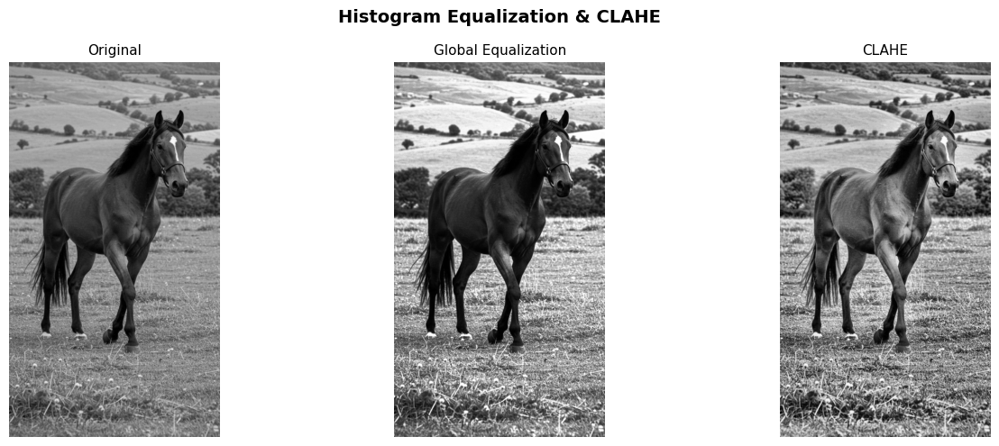

---

## 14. Color Space Conversions

| Space | Best For |
|-------|----------|
| **HSV** | Color-based segmentation |
| **LAB** | Perceptually uniform color distances |
| **YCrCb** | Skin detection, video compression |

```python
hsv   = cv2.cvtColor(img, cv2.COLOR_BGR2HSV)
lab   = cv2.cvtColor(img, cv2.COLOR_BGR2LAB)
ycrcb = cv2.cvtColor(img, cv2.COLOR_BGR2YCrCb)
```

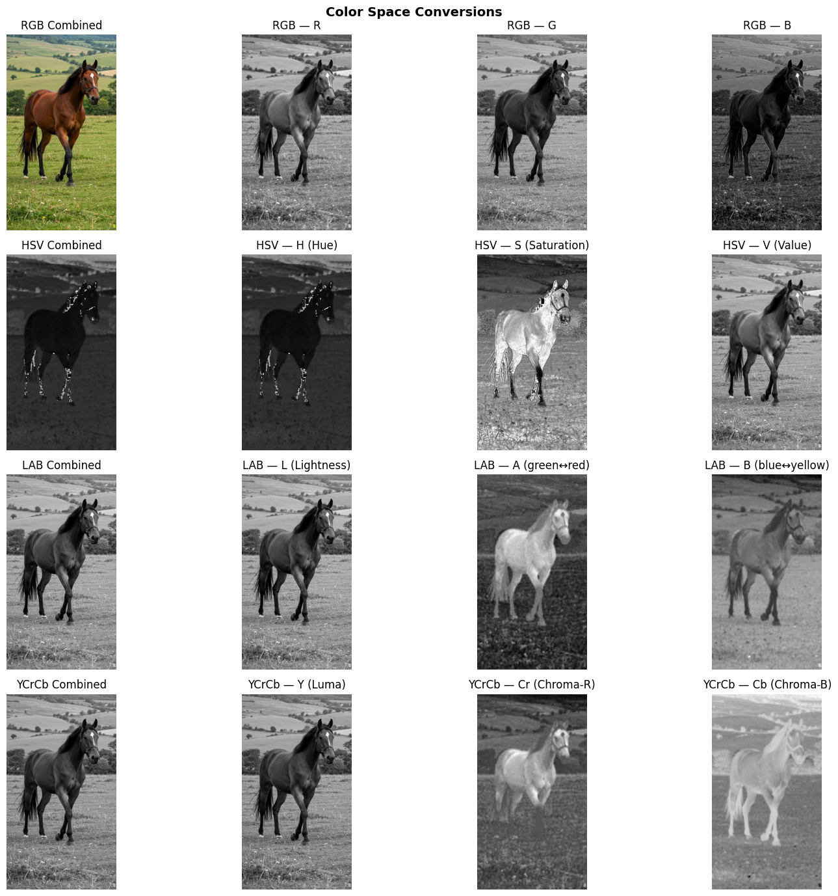

---

## 15. Image Blending & Arithmetic

```python
# dst = α·src1 + β·src2 + γ
blended   = cv2.addWeighted(img1, 0.7, img2, 0.3, 0)
brightened = cv2.add(img,      np.full_like(img, 60))
darkened   = cv2.subtract(img, np.full_like(img, 60))
```

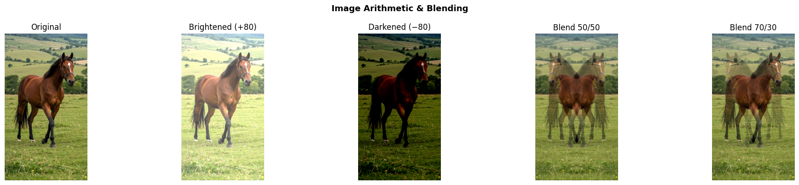

---

## 16. Contour Detection

```python
_, binary = cv2.threshold(gray, 0, 255, cv2.THRESH_BINARY + cv2.THRESH_OTSU)
contours, _ = cv2.findContours(binary, cv2.RETR_EXTERNAL, cv2.CHAIN_APPROX_SIMPLE)
cv2.drawContours(img_copy, contours, -1, (255, 0, 0), 2)
```

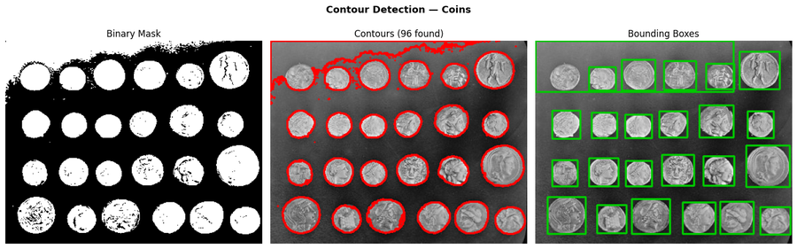

---

## 17. Perspective Transform

```python
M      = cv2.getPerspectiveTransform(src_pts, dst_pts)
warped = cv2.warpPerspective(img, M, (width, height))
```

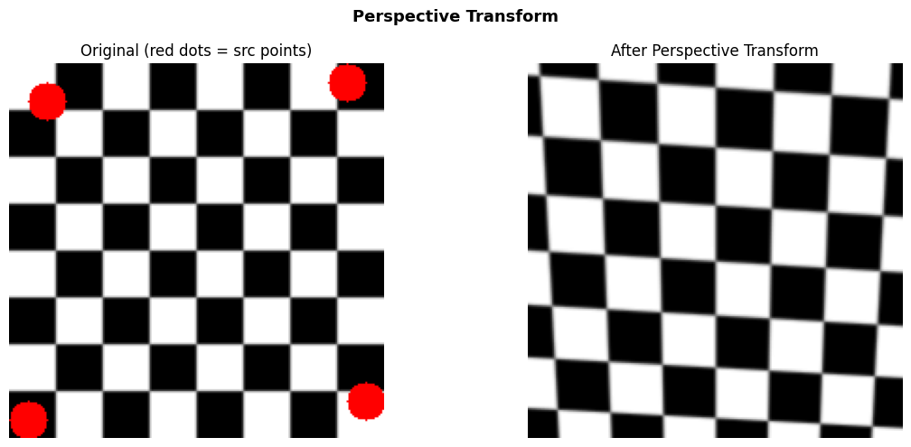

---

## 18. Intensity Transformations

### Image Negative — $s = 255 - r$
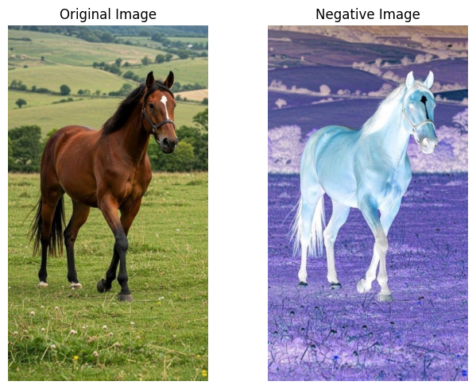

### Log Transform — $s = c \cdot \log(1 + r)$
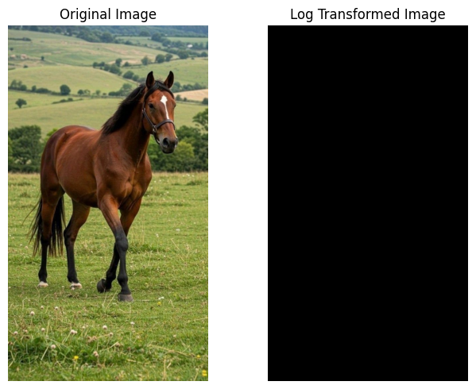

### Gamma — $s = 255 \cdot (r/255)^{\gamma}$


### Contrast Stretching


---

## 19. HOG Feature Extraction

```python
from skimage.feature import hog

features, hog_image = hog(
    image, orientations=9,
    pixels_per_cell=(8, 8),
    cells_per_block=(2, 2),
    visualize=True
)
```

---

## 🗂️ Repository Structure

```
📦 image-processing-opencv
 ┣ 📓 Image_Processing.ipynb    ← notebook (run on Colab for full outputs)
 ┣ 📄 README.md
 ┗ 📁 images/                   ← all output examples shown in this README
```

> 🔗 **Full interactive notebook:** [Open in Google Colab](YOUR_COLAB_LINK_HERE)

---

## 🚧 Coming Next

- [ ] Hough Line & Circle Transform
- [ ] Template Matching
- [ ] Image Segmentation (GrabCut, Watershed)
- [ ] Feature Matching (SIFT, ORB)

---

<div align="center">
Made with ❤️ for the Computer Vision community
<br><br>
⭐ Star the repo if it helped you!
</div>
