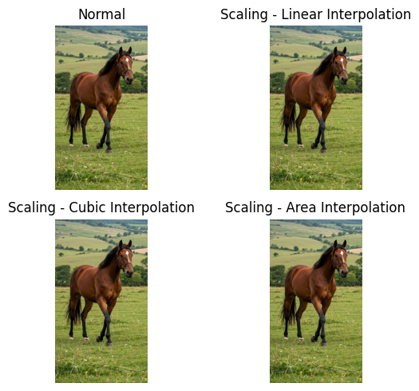
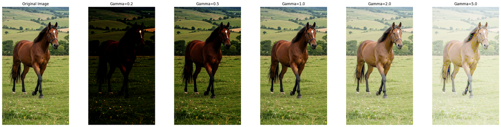
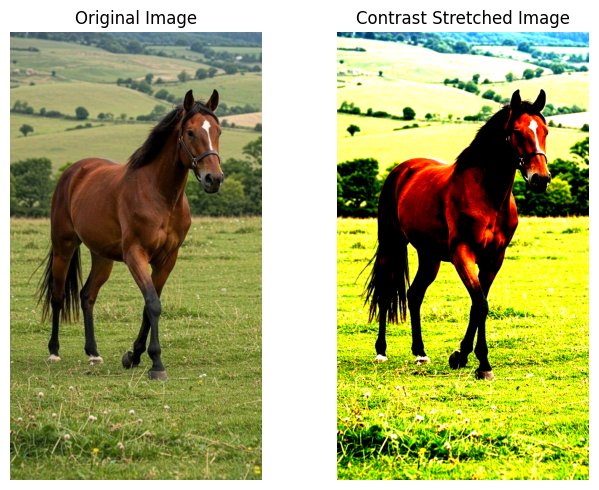

# 🖼️ Image Processing with OpenCV — Reference Notebook

<div align="center">


**A hands-on reference notebook covering the essential image processing operations used every day in Computer Vision.**

[View on Colab](#) · [Report Issue](#) · [Suggest a Topic](#)

</div>

---

## 📌 Why This Notebook?

GitHub doesn't render image outputs inside Jupyter notebooks — which makes image processing notebooks nearly useless to browse online. This README solves that by showing real output examples for every section.

Whether you're a **beginner learning Computer Vision** or an **experienced engineer who wants a quick refresher**, this notebook gives you clean, minimal code for 13 core image processing operations — all in one place, no fluff.

---

## 📦 Requirements

```bash
pip install opencv-python numpy matplotlib
```

> **Note:** The notebook was originally built on Google Colab. If running locally, update the image path in cell 6 from `/content/image.jpg` to your local path.

---

## 📋 Table of Contents

| # | Topic | Key Functions |
|---|-------|---------------|
| 1 | [Reading & Saving Images](#1-reading--saving-images) | `cv2.imread`, `cv2.imwrite`, `cv2.cvtColor` |
| 2 | [Grayscaling](#2-grayscaling) | `cv2.COLOR_BGR2GRAY` |
| 3 | [Image Blurring](#3-image-blurring) | `GaussianBlur`, `medianBlur`, `bilateralFilter` |
| 4 | [Image Resizing](#4-image-resizing) | `cv2.resize`, `INTER_CUBIC`, `INTER_AREA` |
| 5 | [Image Rotation](#5-image-rotation) | `getRotationMatrix2D`, `warpAffine` |
| 6 | [Edge Detection](#6-edge-detection) | `cv2.Canny`, Auto-Canny |
| 7 | [Morphological Operations](#7-morphological-operations) | `dilate`, `erode`, `morphologyEx` |
| 8 | [Flipping](#8-flipping) | `cv2.flip` |
| 9 | [Scaling](#9-scaling) | `cv2.resize` + interpolation flags |
| 10 | [Cropping](#10-cropping) | NumPy slicing |
| 11 | [Sharpening](#11-sharpening) | `cv2.filter2D` + custom kernel |
| 12 | [Thresholding](#12-thresholding) | `cv2.threshold` (5 methods) |
| 13 | [Intensity Transformations](#13-intensity-transformations) | Negative, Log, Gamma, Contrast Stretching |

---

## 1. Reading & Saving Images

The foundation of every CV pipeline. OpenCV reads images in **BGR** format — not RGB — so always convert before displaying with Matplotlib.

```python
img = cv2.imread('image.jpg', 1)          # 1 = color, 0 = grayscale
plt.imshow(cv2.cvtColor(img, cv2.COLOR_BGR2RGB))
cv2.imwrite('output.jpg', img)
```


---

## 2. Grayscaling

Converting to grayscale reduces the image from 3 channels to 1, cutting model complexity and computation time. Shown below: three equivalent ways to get a grayscale image.

```python
gray = cv2.cvtColor(img, cv2.COLOR_BGR2GRAY)  # Method 1
gray = cv2.imread('image.jpg', 0)              # Method 2 — read as gray directly
```


> **CV Tip:** `img.shape` goes from `(H, W, 3)` → `(H, W)` after grayscaling. Many OpenCV operations (Canny, morphology) require a single-channel input.

---

## 3. Image Blurring

Blurring removes noise before feeding an image into detection or segmentation models. Three methods, each with different trade-offs:

| Method | Best For | Preserves Edges? |
|--------|----------|:---:|
| `GaussianBlur` | General noise, preprocessing | ❌ |
| `medianBlur` | Salt-and-pepper noise | ⚠️ Partially |
| `bilateralFilter` | Noise reduction with edge preservation | ✅ |

```python
gaussian = cv2.GaussianBlur(img, (13, 5), 0)
median   = cv2.medianBlur(img, 13)
bilateral = cv2.bilateralFilter(img, 9, 75, 75)
```


---

## 4. Image Resizing

Resize images using scale factors or absolute dimensions. The interpolation method matters — wrong choice degrades quality.

```python
zoomed  = cv2.resize(img, None, fx=3.0, fy=3.0, interpolation=cv2.INTER_CUBIC)
reduced = cv2.resize(img, None, fx=1/3, fy=1/3, interpolation=cv2.INTER_AREA)
```

> **Rule of thumb:** Use `INTER_AREA` for shrinking, `INTER_CUBIC` or `INTER_LINEAR` for enlarging.

---

## 5. Image Rotation

Rotate around any center point by any angle. Positive angle = clockwise; negative = counterclockwise.

```python
center = (img.shape[1] // 2, img.shape[0] // 2)
M = cv2.getRotationMatrix2D(center, angle=30, scale=1)
rotated = cv2.warpAffine(img, M, (img.shape[1], img.shape[0]))
```


---

## 6. Edge Detection

Implements an **Auto-Canny** function that automatically computes the optimal thresholds based on the image's median pixel intensity — no manual tuning needed.

```python
def auto_canny(image, sigma=0.33):
    v = np.median(image)
    lower = int(max(0, (1.0 - sigma) * v))
    upper = int(min(255, (1.0 + sigma) * v))
    return cv2.Canny(image, lower, upper)
```


> **Pro Tip:** Always apply Gaussian blur before Canny to reduce false edges from noise.

---

## 7. Morphological Operations

Morphological ops work on the **shape/structure** of objects in binary or grayscale images. Essential for cleaning up segmentation masks and removing artifacts.

```python
kernel  = np.ones((5, 5), np.uint8)
dilated = cv2.dilate(gray, kernel, iterations=1)
eroded  = cv2.erode(gray, kernel, iterations=1)
opening = cv2.morphologyEx(gray, cv2.MORPH_OPEN, kernel)   # erode → dilate (removes small noise)
closing = cv2.morphologyEx(gray, cv2.MORPH_CLOSE, kernel)  # dilate → erode (fills small holes)
```


---

## 8. Flipping

Simple but frequently used for **data augmentation** during training.

```python
hflip = cv2.flip(img, 1)   # Horizontal
vflip = cv2.flip(img, 0)   # Vertical
both  = cv2.flip(img, -1)  # Both axes
```


---

## 9. Scaling

A deeper look at interpolation methods when scaling images:

| Flag | Method | Quality | Speed |
|------|--------|---------|-------|
| `INTER_NEAREST` | Nearest-neighbor | Low | ⚡ Fastest |
| `INTER_LINEAR` | Bilinear | Medium | Fast |
| `INTER_CUBIC` | Bicubic | High | Medium |
| `INTER_LANCZOS4` | Lanczos | Best | Slowest |
| `INTER_AREA` | Pixel area relation | Best for shrinking | Medium |



---

## 10. Cropping

Cropping in OpenCV is pure NumPy array slicing — no special function needed.

```python
cropped = img[start_row:end_row, start_col:end_col]
# Example: img[100:300, 120:300]
```


---

## 11. Sharpening

Sharpening uses a convolution kernel that boosts the center pixel while subtracting its neighbors — amplifying edges and fine detail.

```python
kernel = np.array([[-1, -1, -1],
                   [-1,  9, -1],
                   [-1, -1, -1]])
sharpened = cv2.filter2D(img, -1, kernel)
```


---

## 12. Thresholding

Converts a grayscale image into a binary mask. Five methods covered:

```python
_, binary    = cv2.threshold(img, 170, 255, cv2.THRESH_BINARY)
_, inv_bin   = cv2.threshold(img, 170, 255, cv2.THRESH_BINARY_INV)
_, trunc     = cv2.threshold(img, 170, 255, cv2.THRESH_TRUNC)
_, to_zero   = cv2.threshold(img, 170, 255, cv2.THRESH_TOZERO)
_, to_zero_i = cv2.threshold(img, 170, 255, cv2.THRESH_TOZERO_INV)
```


---

## 13. Intensity Transformations

Mathematical transformations applied directly on pixel values to control brightness, contrast, and dynamic range.

### Image Negative
$$s = 255 - r$$


### Log Transform — expands dark regions
$$s = c \cdot \log(1 + r)$$


### Gamma (Power-Law) — controls brightness curve
$$s = c \cdot r^{\gamma}$$



### Contrast Stretching (Piecewise-Linear)



---

## 🚧 What's Coming Next

- [ ] Histogram Equalization (CLAHE)
- [ ] Color Space Exploration (HSV, LAB, YCrCb)
- [ ] Contour Detection
- [ ] Image Blending & Arithmetic
- [ ] Perspective & Affine Transforms
- [ ] Hough Line & Circle Transforms
- [ ] HOG Feature Extraction
- [ ] Adaptive Thresholding & Otsu's Method

---

## 🤝 Contributing

Found a bug or want to suggest a topic? Open an issue or submit a PR. Beginners welcome!

---

## 📄 License

This project is open source and available under the [MIT License](LICENSE).

---

<div align="center">
Made with ❤️ for the Computer Vision community
</div>
